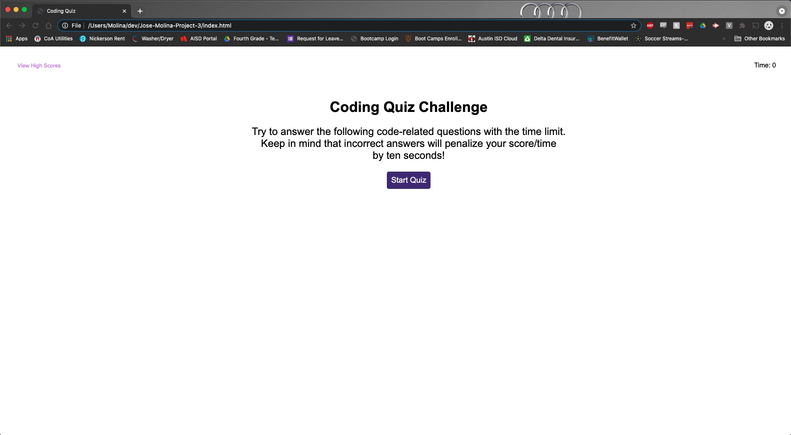
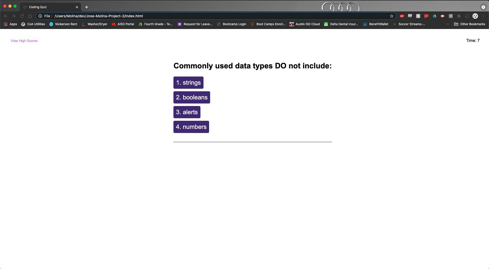
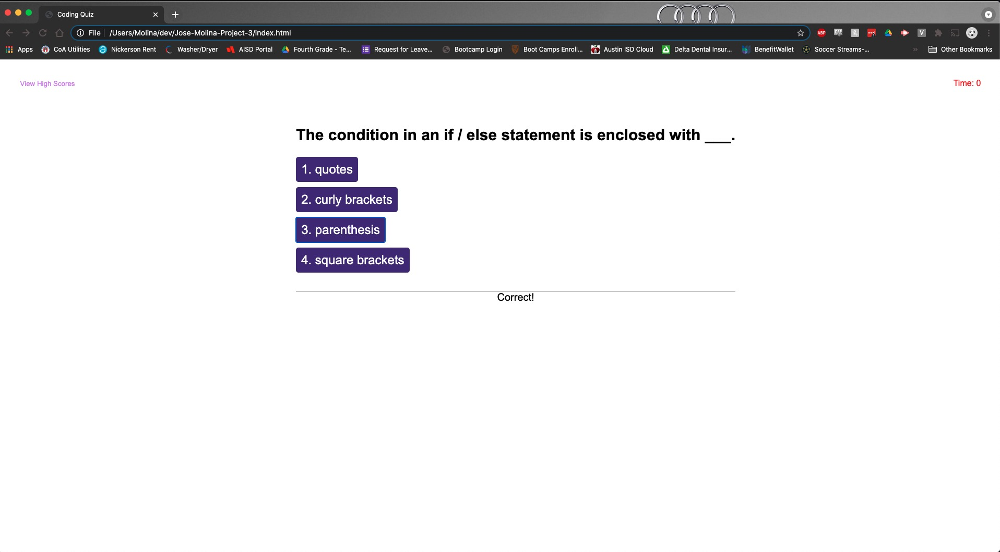
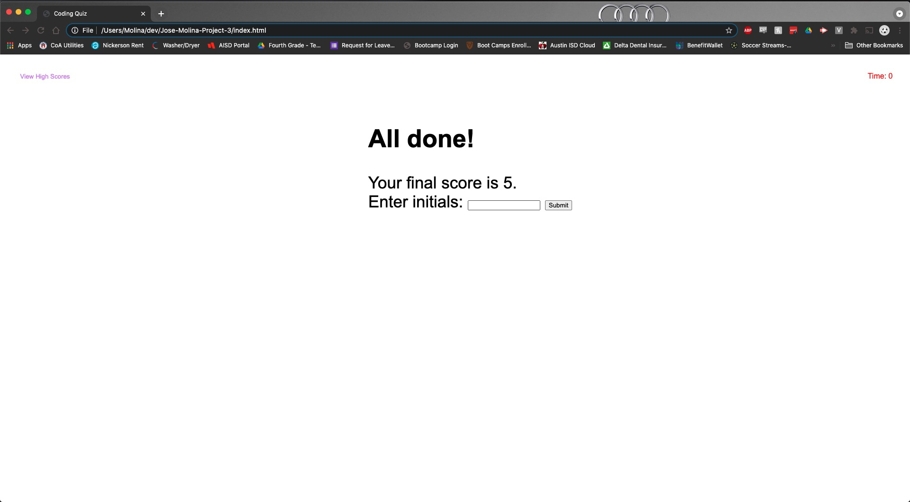
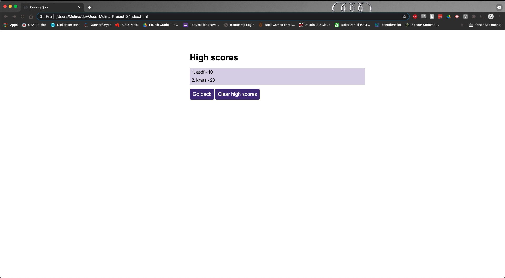

# Jose-Molina-Project-4

This is my attempt at creating an online JavaScript timed quiz that tells users when they got a question correct and incorrect. It also allows you to store your initials along with your score to create a highscore list.

Screenshots

